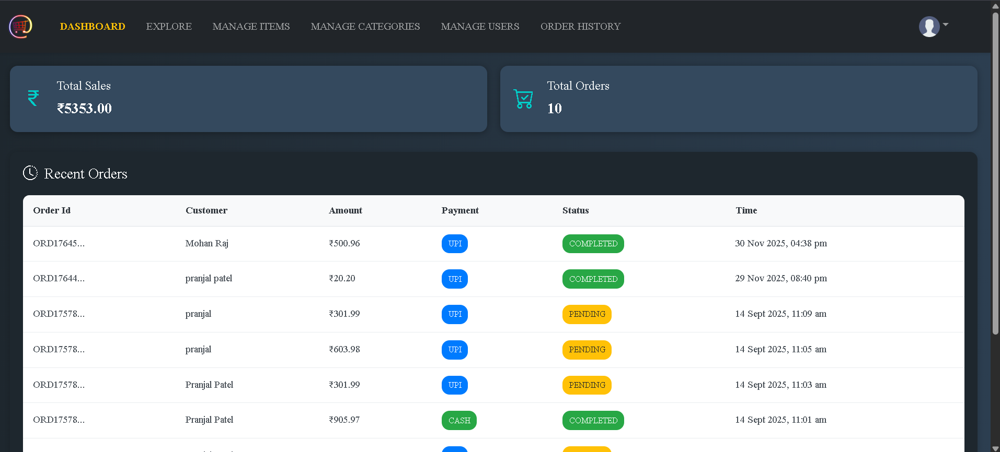
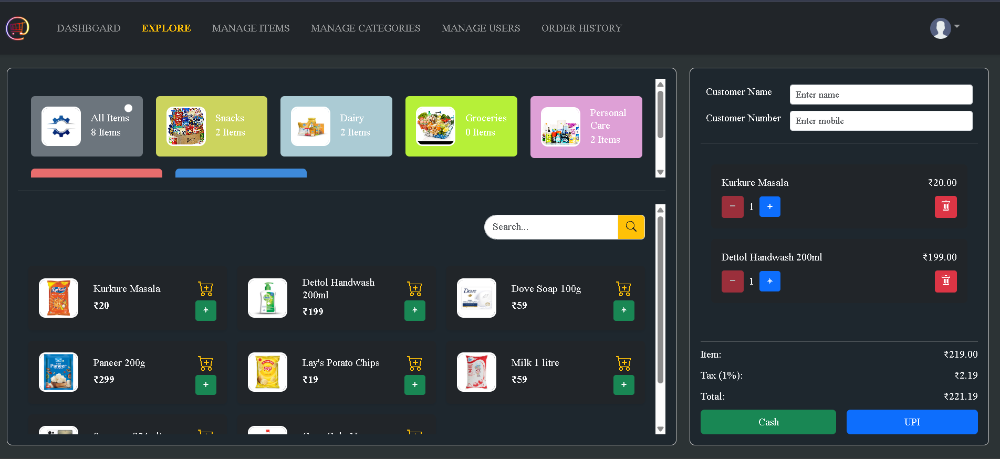
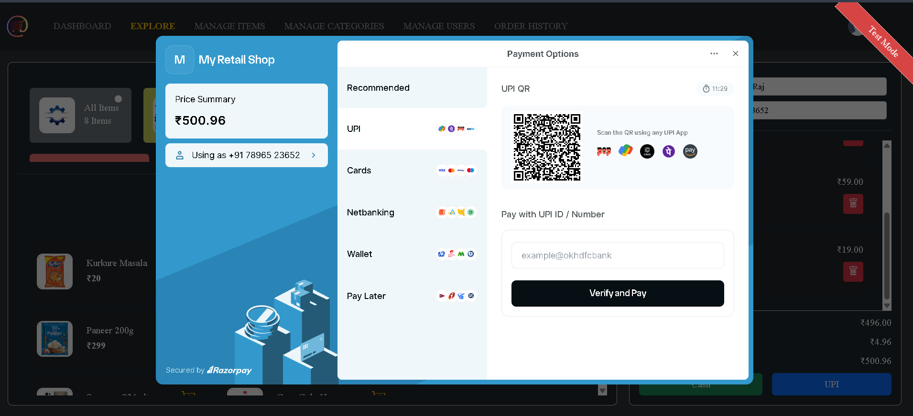
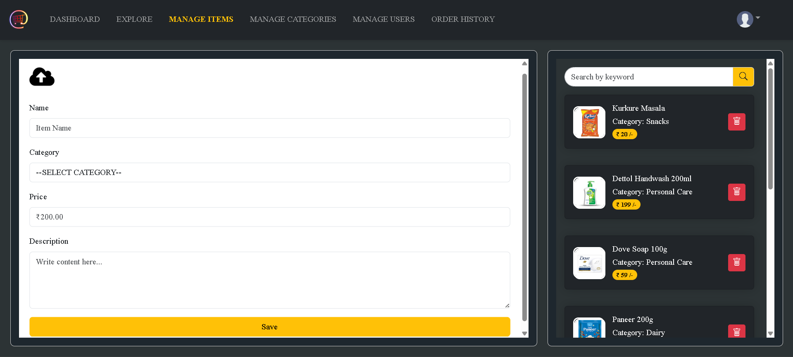
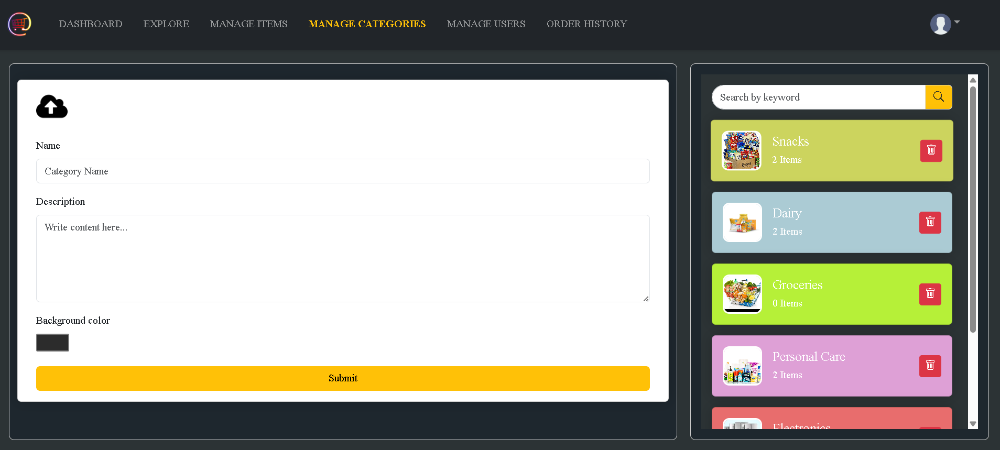
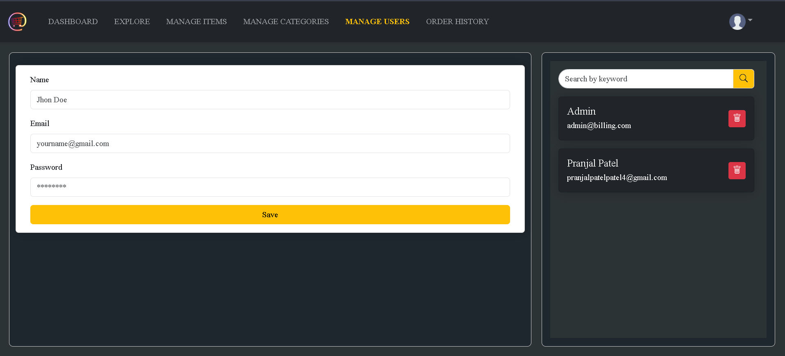
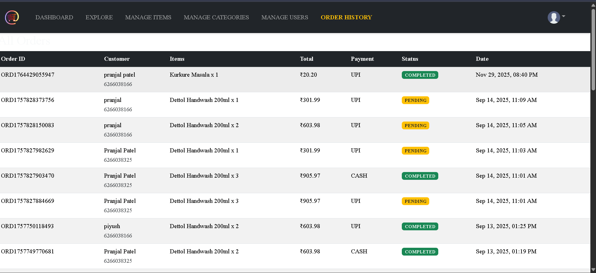

# 🧾 Billing Management System

A **full-stack Retail Billing & Inventory Management System** built with **Spring Boot, React.js, MySQL, and Razorpay**.  
It includes **Admin Panel** for managing users, categories, items, and **User Panel** for billing, cart, payments, and receipts.

---

## ✨ Features

### 🔑 Authentication & Roles
- Secure login with **Spring Security + JWT authentication**
- Role-based access:
  - **Admin** → manage staff users, categories, items, orders
  - **Staff/User** → create customer bills, process payments

### 🛒 Billing & Orders
- Add items to cart, update quantity, remove items
- Generate customer orders with **Cash** or **UPI (Razorpay test)**
- Auto calculate subtotal, tax (1%), and total
- Print **receipt popup** with order details

### 📊 Admin Panel
- Manage **users** (add/edit staff accounts)
- Manage **categories & items** (with image upload and color selection)
- View order history and reports

### 💳 Payment Integration
- **Cash mode** → instant order confirmation  
- **UPI mode** → Razorpay test payment flow (no real money)  
- Payment verification and failure handling included

---

## 🛠️ Tech Stack

**Frontend:** React.js, Bootstrap, Context API, React Hot Toast  
**Backend:** Spring Boot, Spring Security (JWT), JPA/Hibernate  
**Database:** MySQL (Railway/Local)  
**Payments:** Razorpay (Test Keys)  

---
⚠️ Note: Razorpay integration runs in **test mode** → no real payments.

---

## 📸 Screenshots

#### Login

#### Dashboard

#### Explore

#### Manage Items

#### Manage Categories

#### Manage Users

#### Order History

---
