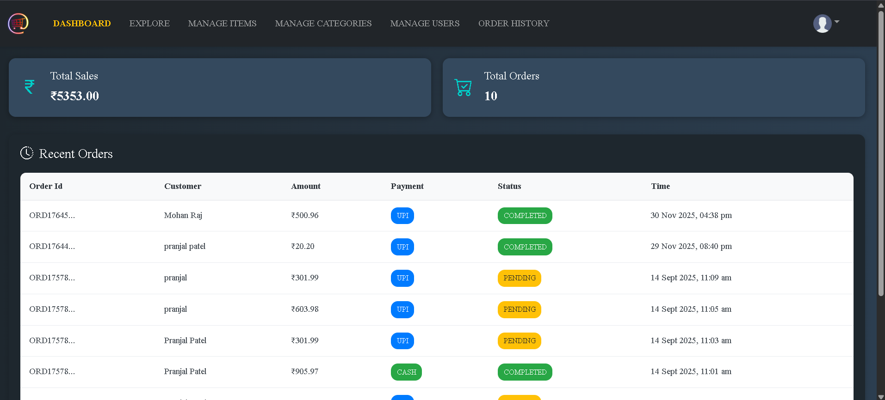
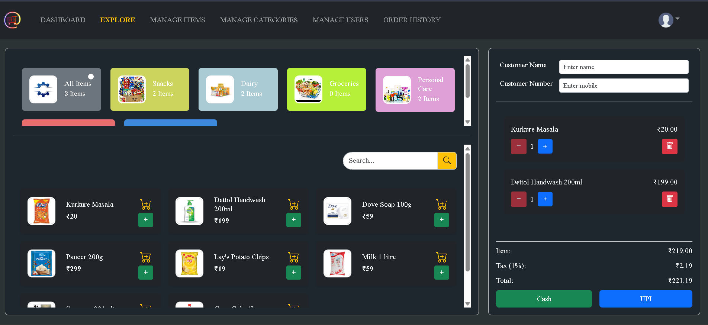
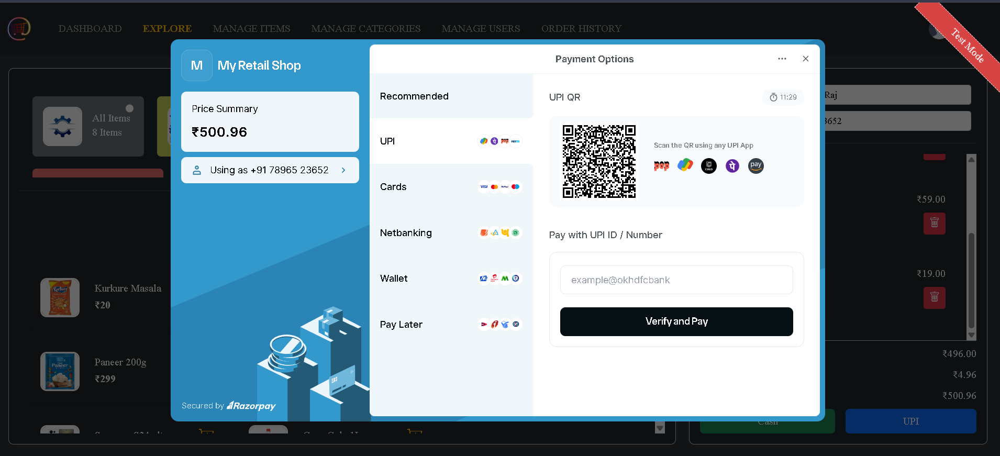
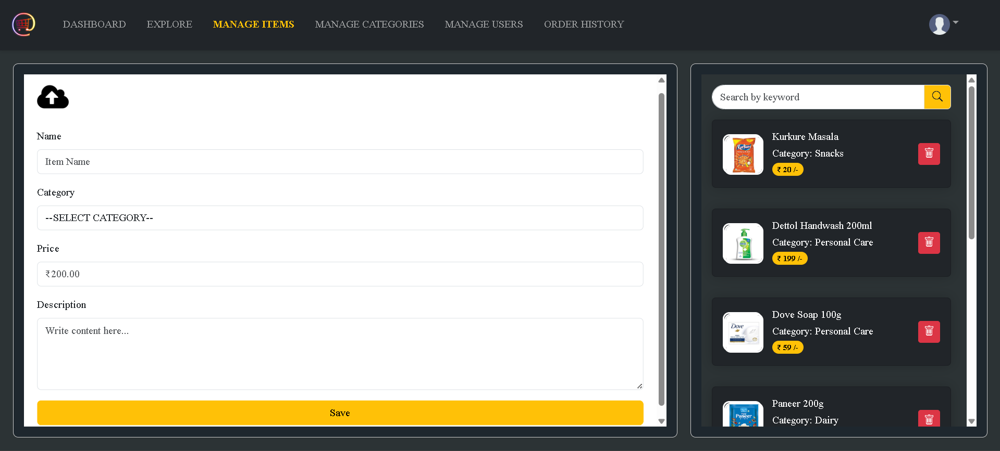
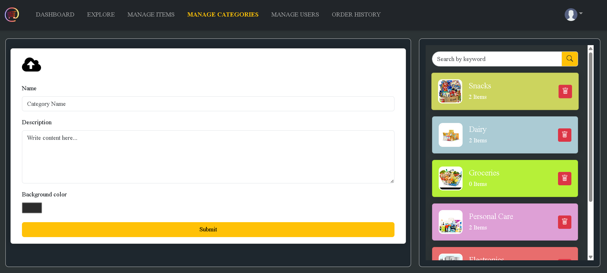
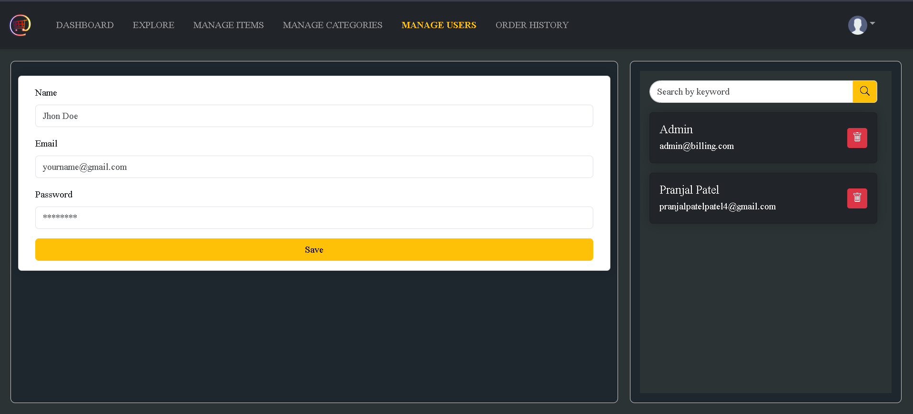
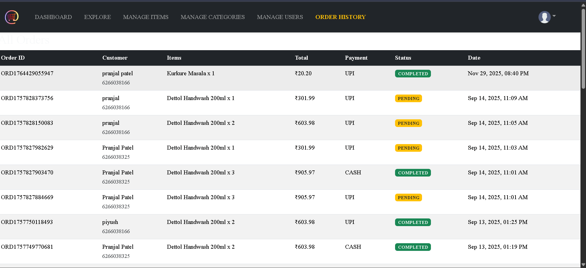

# 🧾 Billing & POS Management System
       

A **full-stack Retail Billing & POS Management System** designed for small retail stores and supermarkets.
The system provides a **Point of Sale (POS) interface** for staff to generate customer bills and an Admin Panel for managing users, categories, items, and order history.

Built with **Spring Boot, React.js, MySQL, and Razorpay (test mode)** to simulate a real-world retail billing environment.

---

## 🚀 Key Features

### 🔐 Authentication & Authorization
- Secure login with **Spring Security + JWT authentication**
- Role-based access control:
  - **Admin** → manage staff users, categories, items, orders
  - **Staff/User** → create customer bills,Add items to cart, process payments

### 🛒 Billing & Order Management
- POS-style billing interface
- Add items to cart with quantity control
- Remove items from cart
- Real-time subtotal, tax, and total calculation
- Generate customer orders with **Cash** or **UPI (Razorpay test)**
- Print **receipt popup** with order details

### 📦 Inventory Management (Admin)
- Manage **users** (add/remove staff accounts)
- Manage **categories & items** 
- Upload product images
- Select custom category colors for UI display

### 📊 Order History & Reporting
- View previous orders
- Track order details
- Monitor store sales activity

### 💳 Payment Integration
Two payment options available:
- **Cash mode** → instant order confirmation  
- **UPI mode** → Razorpay test payment flow 
- Payment verification and failure handling included
⚠️ Note: Razorpay integration runs in test mode → no real payments.
---

## 🏗 System Architecture
React UI
   ↓
Axios API
   ↓
JWT Authentication
   ↓
Spring Security
   ↓
Controller → Service → Repository
   ↓
MySQL Database
   ↓
External Services (Razorpay + AWS S3)

## Database Setup

- The first admin account is created manually using SQL
- All other users are created through the Admin panel API
- Passwords are stored securely using BCrypt hashing
- Example admin insert:
``` sql
INSERT INTO tbl_users (user_id,email,password,role,name)
VALUES (
'ADMIN001',
'admin@example.com',
'<bcrypt-password>',
'ROLE_ADMIN',
'Admin'
);

```

## 🛠️ Tech Stack

**Frontend:** React.js, Bootstrap, Axios API, React Hot Toast  
**Backend:** Spring Boot, Spring Security, JWT Authentication, Spring Data JPA / Hibernate 
**Database:** MySQL   
**Payment Gateway:** Razorpay (Test Mode)
**Image Store:** AWS S3

---

## 📸 Screenshots

#### Login


#### Dashboard


#### Explore / POS Billing



#### Manage Items


#### Manage Categories


#### Manage Users


#### Order History


---

## ⚙️ Project Setup (Local Development)

### Backend Setup
```bash
git clone https://github.com/your-username/billing-management-backend.git
cd billing-management-backend
./mvnw spring-boot:run
```
Backend will start on: http://localhost:8080

### Frontend Setup
```bash
git clone https://github.com/your-username/billing-management-frontend.git
cd billing-management-frontend
npm install
npm start
```
Frontend will start on: http://localhost:5173

### 👨‍💻 Author

Pranjal Patel
Java Full-Stack Developer

Tech Stack:
Spring Boot • React.js • MySQL • JWT • Razorpay

### ⭐ If you like this project
Give it a star on GitHub ⭐